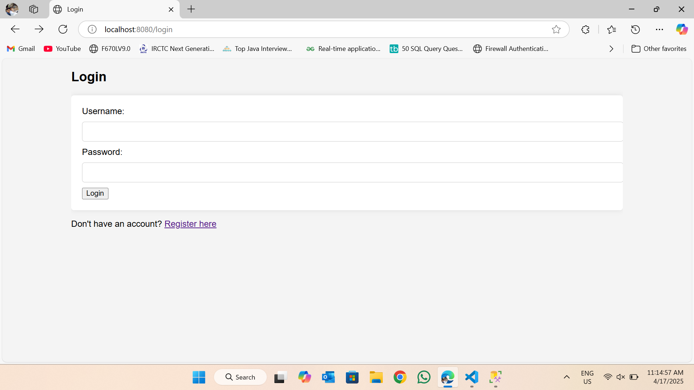

# Spring Boot CSV Web Application

## Overview
This project is a web application developed using Spring Boot, which allows users to register, log in, manage their profiles, and upload CSV files. The application provides functionalities to run SQL queries on the uploaded CSV files and store them in a Microsoft SQL Server database.

## Project Structure
```
springboot-csv-webapp
├── src
│   ├── main
│   │   ├── java
│   │   │   └── com
│   │   │       └── example
│   │   │           └── csvwebapp
│   │   │               ├── CsvWebappApplication.java
│   │   │               ├── controller
│   │   │               │   ├── AuthController.java
│   │   │               │   ├── ProfileController.java
│   │   │               │   └── CsvController.java
│   │   │               ├── model
│   │   │               │   ├── User.java
│   │   │               │   └── CsvRecord.java
│   │   │               ├── repository
│   │   │               │   ├── UserRepository.java
│   │   │               │   └── CsvRepository.java
│   │   │               └── service
│   │   │                   ├── AuthService.java
│   │   │                   ├── ProfileService.java
│   │   │                   └── CsvService.java
│   │   ├── resources
│   │   │   ├── static
│   │   │   │   ├── css
│   │   │   │   │   └── style.css
│   │   │   │   └── js
│   │   │   │       └── script.js
│   │   │   ├── templates
│   │   │   │   ├── login.html
│   │   │   │   ├── register.html
│   │   │   │   ├── profile.html
│   │   │   │   └── csv.html
│   │   │   └── application.properties
│   └── test
│       └── java
│           └── com
│               └── example
│                   └── csvwebapp
│                       └── CsvWebappApplicationTests.java
├── .gitignore
├── pom.xml
└── README.md
```

## Technologies Used
- **HTML/CSS**: For front-end development.
- **Java**: For back-end development.
- **Spring Boot**: For building the web application.
- **MS SQL Server**: For database management.

## Setup Instructions
1. **Clone the Repository**
   ```
   git clone <repository-url>
   cd springboot-csv-webapp
   ```

2. **Configure Database**
   - Ensure that MS SQL Server is installed and running.
   - Create a database for the application.
   - Update the `application.properties` file with the database connection details:
     ```
     spring.datasource.url=jdbc:sqlserver://KRISHNA;databaseName=csvwebappdb;encrypt=true;trustServerCertificate=true
     spring.datasource.username=sa
     spring.datasource.password=sa
     ```

3. **Build the Project**
   - Use Maven to build the project:
     ```
     mvn clean install
     ```

4. **Run the Application**
   - Start the Spring Boot application:
     ```
     mvn spring-boot:run
     ```

5. **Access the Application**
   - Open a web browser and navigate to `http://localhost:8080`.

## Features
- **User Authentication**: Users can register and log in to the application.
- **User Profile Management**: Users can view and update their profiles.
- **CSV File Upload**: Users can upload CSV files for processing.
- **SQL Query Execution**: Users can run SQL queries on the uploaded CSV data.

## License
This project is licensed under the MIT License. See the LICENSE file for more details.

# Screenshot
